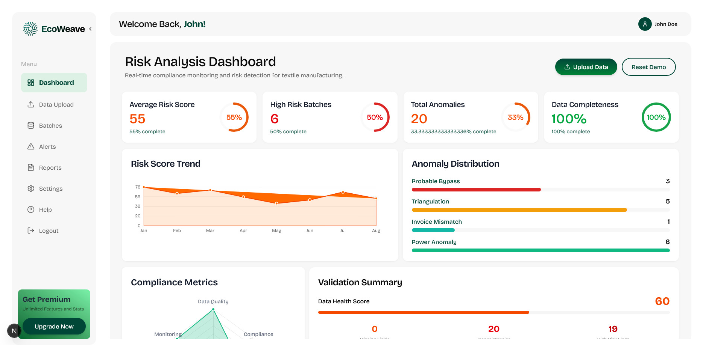
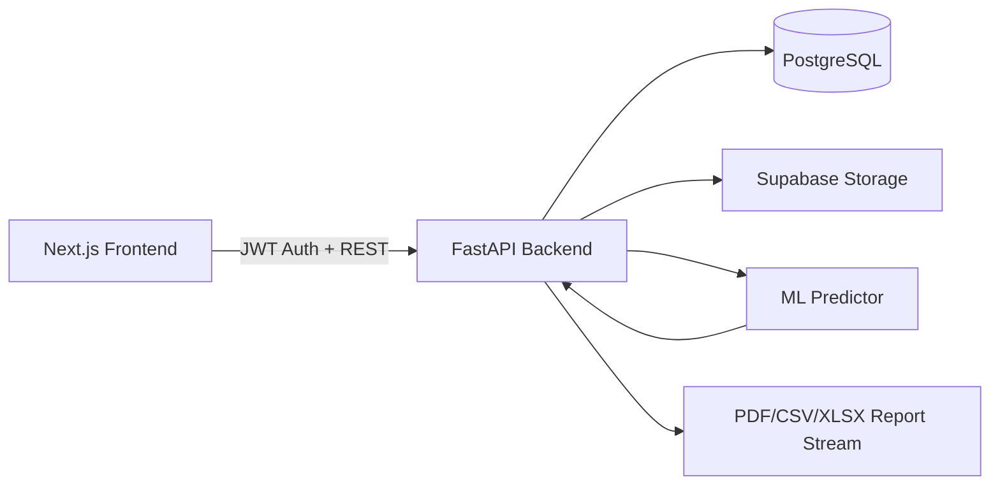

# EcoWeave

<p align="center">
  
</p>

<p align="center">
  AI-driven textile compliance platform for risk scoring, anomaly detection, alerts, and reporting.
</p>

<p align="center">
  
</p>

## Table of Contents

1. Project Overview
2. System Architecture
3. Backend Analysis
4. Frontend Analysis
5. API Surface
6. Data Model
7. Project Structure
8. Local Development Setup
9. Environment Variables
10. Engineering Assessment

## Project Overview

EcoWeave is a full-stack compliance analytics platform focused on textile wastewater risk management. It provides:

- User authentication and profile management
- CSV ingestion for batch-level operational data
- ML/rule-based risk scoring and anomaly flagging
- Alert generation and lifecycle tracking
- Batch analytics dashboards
- Multi-format report export (PDF, CSV, XLSX)
- User-configurable settings

The codebase is split into:

- `backend/`: FastAPI + SQLAlchemy + PostgreSQL/Alembic + Supabase storage + ML scoring
- `frontend/`: Next.js App Router + TypeScript + Tailwind + custom/shadcn-style UI components

## System Architecture



Core runtime flow:

1. User signs in/up and receives JWT.
2. Frontend stores JWT in localStorage (`ecoweave_token`).
3. CSV upload triggers backend ingestion and scoring.
4. Backend persists `BatchRecord` rows and derived `Alert` entries.
5. Frontend consumes batch stats, alerts, and report endpoints for dashboards.

## Backend Analysis

### Backend Stack

- FastAPI (`fastapi[standard]`)
- SQLAlchemy ORM
- Alembic migrations
- PostgreSQL driver (`psycopg2-binary`)
- Authentication: JWT (`python-jose`) + password hashing (`bcrypt`, `passlib`)
- Data processing: `pandas`, `numpy`
- ML/runtime scoring: `scikit-learn`, `joblib`
- Report generation: `fpdf2`, `openpyxl`
- File storage integration: Supabase

### Backend Composition

- Entry point: `backend/main.py`
  - Registers routers
  - Configures CORS
  - Loads ML model at startup
  - Creates tables with `Base.metadata.create_all`
- Database layer: `backend/src/database.py`
- ORM models: `backend/src/models.py`
- Domain modules:
  - `auth`
  - `csv_upload`
  - `batch`
  - `alerts`
  - `reports`
  - `settings`
  - `ml`

### Backend Domain Behavior

#### Authentication

- Signup/login issue access token and user payload.
- Protected endpoints use `HTTPBearer` and user lookup by `sub` claim.
- Profile and password update endpoints are present.

#### CSV Upload and Scoring

- Upload endpoint validates CSV extension/content.
- Stores file metadata and (if configured) uploads to Supabase bucket `ETP_DATA`.
- Iterates rows, normalizes numeric/date values, runs `predict_batch`.
- Persists scored batches and generates alerts when risk is high or severe flags exist.

#### ML Scoring

- Attempts to load `models/ecoweave_model.pkl`.
- If unavailable/failing, falls back to deterministic rule-based scoring.
- Returns:
  - `risk_score`
  - `bypass_prediction`
  - `estimated_loss_bdt`
  - `flags`

#### Alerts, Reports, and Settings

- Alerts support filtering, status transitions, stats, and resolved cleanup.
- Reports support export in PDF/CSV/XLSX streams with date filtering.
- Settings supports user preference retrieval and update.

## Frontend Analysis

### Frontend Stack

- Next.js 16 (App Router)
- React 19 + TypeScript
- Tailwind CSS v4
- Framer Motion / Motion
- Lucide icons
- shadcn-compatible component structure (`components.json` configured)

### Frontend Routing Model

The app uses route groups:

- `(marketing)` public landing experience
- `(auth)` sign-in/sign-up/forgot-password pages
- `(app)` authenticated product area (dashboard, alerts, batches, reports, settings, help)

Auth behavior:

- `(app)` layout wraps pages with `AuthProvider` and `AuthGuard`
- Non-authenticated users are redirected to `/signin`
- API client auto-clears token and redirects on 401

### Frontend State and Data Flow

- API client: `frontend/src/lib/api.ts`
  - Injects bearer token
  - Provides typed helper methods per backend domain
- Auth context: `frontend/src/lib/auth-context.tsx`
  - Maintains `user`, `token`, `isAuthenticated`, loading state
- Dashboard and feature pages hydrate from backend if available, with local fallback for some modules.

### UI/Design System

- Shared UI primitives in `frontend/src/components/ui`
- App-level shells:
  - `Topbar`
  - `Sidebar`
  - page cards/charts/panels
- Marketing sections:
  - Hero
  - Feature blocks
  - How-it-works timeline
  - Testimonials
  - Pricing
  - FAQ
  - CTA

## API Surface

### Authentication (`/api/auth`)

- `POST /signup`
- `POST /login`
- `GET /me`
- `PUT /profile`
- `PUT /password`

### CSV Upload (`/api/csv-upload`)

- `POST /upload`
- `GET /uploads`
- `GET /uploads/{upload_id}`
- `DELETE /uploads/{upload_id}`

### Batches (`/api/batches`)

- `GET /stats`
- `GET /`
- `GET /{batch_id}`

### Alerts (`/api/alerts`)

- `GET /stats`
- `GET /`
- `PATCH /{alert_id}`
- `DELETE /`

### Reports (`/api/reports`)

- `POST /generate`

### Settings (`/api/settings`)

- `GET /`
- `PUT /`

### ML (`/api/ml`)

- `GET /status`
- `POST /score`

## Data Model

Primary entities from `backend/src/models.py`:

- `User`
  - identity and account metadata
- `CSVUpload`
  - uploaded file metadata, linked to user
- `BatchRecord`
  - normalized operational batch metrics and scoring output
- `Alert`
  - risk-triggered incident records and status lifecycle
- `UserSettings`
  - notification and retention preferences

Key relationships:

- `User 1..* CSVUpload`
- `User 1..* BatchRecord`
- `User 1..* Alert`
- `User 1..1 UserSettings`
- `CSVUpload 1..* BatchRecord`
- `BatchRecord 1..* Alert`

## Project Structure

```text
EcoWeave/
├── backend/
│   ├── main.py
│   ├── requirements.txt
│   ├── alembic.ini
│   ├── migrations/
│   │   ├── env.py
│   │   └── versions/
│   └── src/
│       ├── database.py
│       ├── models.py
│       ├── supabase_client.py
│       ├── auth/
│       │   ├── route.py
│       │   ├── schema.py
│       │   └── security.py
│       ├── csv_upload/
│       │   ├── route/csv_upload.py
│       │   ├── schema/csv_upload.py
│       │   └── model/csv_upload.py
│       ├── batch/
│       │   ├── route.py
│       │   └── schema.py
│       ├── alerts/
│       │   ├── route.py
│       │   └── schema.py
│       ├── reports/
│       │   ├── route.py
│       │   └── schema.py
│       ├── settings/
│       │   ├── route.py
│       │   └── schema.py
│       └── ml/
│           ├── route.py
│           └── predictor.py
├── frontend/
│   ├── package.json
│   ├── next.config.ts
│   ├── tsconfig.json
│   ├── components.json
│   ├── public/
│   │   ├── dashboard.png
│   │   └── logo/logo4.png
│   └── src/
│       ├── app/
│       │   ├── layout.tsx
│       │   ├── globals.css
│       │   ├── (marketing)/
│       │   ├── (auth)/
│       │   └── (app)/
│       ├── components/
│       │   ├── app/
│       │   ├── layout/
│       │   ├── sections/
│       │   └── ui/
│       └── lib/
│           ├── api.ts
│           ├── auth-context.tsx
│           ├── risk.ts
│           ├── types.ts
│           └── utils.ts
└── DASHBOARD_IMPLEMENTATION.md
```

## Local Development Setup

### Prerequisites

- Node.js 18+ (recommended 20+)
- Python 3.10+ (project currently includes a local `.venv`)
- PostgreSQL

### 1) Backend Setup

```bash
cd backend
python -m venv .venv
.venv\Scripts\activate
pip install -r requirements.txt
```

Create `backend/.env`:

```env
DATABASE_URL=postgresql+psycopg2://<user>:<password>@localhost:5432/<db_name>
JWT_SECRET_KEY=<your-secret>
ACCESS_TOKEN_EXPIRE_MINUTES=1440
SUPABASE_URL=<optional>
SUPABASE_KEY=<optional>
```

Run backend:

```bash
uvicorn main:app --reload --host 0.0.0.0 --port 8000
```

Optional migration workflow:

```bash
alembic upgrade head
```

### 2) Frontend Setup

```bash
cd frontend
npm install
```

Create `frontend/.env.local`:

```env
NEXT_PUBLIC_API_URL=http://localhost:8000
```

Run frontend:

```bash
npm run dev
```

Open:

- Frontend: `http://localhost:3000`
- Backend API docs: `http://localhost:8000/docs`

## Environment Variables

### Backend

| Variable | Required | Purpose |
|---|---|---|
| `DATABASE_URL` | Yes | SQLAlchemy DB connection string |
| `JWT_SECRET_KEY` | Yes (for production) | JWT signing secret |
| `ACCESS_TOKEN_EXPIRE_MINUTES` | No | Token expiration window |
| `SUPABASE_URL` | Optional | Supabase project URL |
| `SUPABASE_KEY` | Optional | Supabase service key for storage |

### Frontend

| Variable | Required | Purpose |
|---|---|---|
| `NEXT_PUBLIC_API_URL` | Yes | Backend base URL for API client |

## Engineering Assessment

### Current Strengths

- Clear domain segmentation in both backend and frontend.
- Consistent API client abstraction and auth context in frontend.
- Practical ingestion-to-alert pipeline with fallback scoring.
- Export capabilities (PDF/CSV/XLSX) implemented and integrated.
- Good baseline of type-safe UI code and modern Next.js architecture.

### Improvement Opportunities

- Add automated tests:
  - Backend: endpoint and service-level tests
  - Frontend: component + integration tests
- Tighten production CORS policy (avoid permissive wildcard behavior).
- Replace startup `create_all` with migration-only schema control for stricter environments.
- Add structured logging and request tracing across critical endpoints.
- Add CI pipeline with lint/type/test/build gates.
- Add deployment manifests and environment-specific configuration templates.

---

This README reflects the current codebase structure and behavior in this repository.
